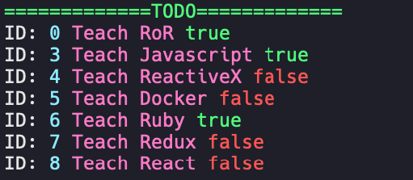

# CLI ToDo List

### Installs

with `Docker` without packages
```shell
docker-compose run app yarn add yargs colors
docker-compose run app yarn add nodemon --dev
```

With `package.json` and packages
```shell
docker-compose up
```

### Structure

> run `tree -I "node_modules|screenshots"`
```shell
.
├── Dockerfile
├── README.md
├── db
│   └── database.json
├── docker-compose.yml
├── package.json
├── src
│   ├── app.js
│   ├── config
│   │   ├── index.js
│   │   └── yargs.js
│   ├── decorators
│   │   ├── index.js
│   │   └── list.js
│   ├── helpers
│   │   ├── array-indexing.js
│   │   └── index.js
│   ├── services
│   │   ├── file-system
│   │   │   ├── file-system.js
│   │   │   └── index.js
│   │   ├── index.js
│   │   ├── load-db.js
│   │   ├── save-db.js
│   │   └── save-fs.js
│   ├── todo
│   │   ├── index.js
│   │   └── to-do.js
│   └── validations
│       ├── index.js
│       └── validations.js
└── yarn.lock

9 directories, 23 files
```

### Screenshots

<p align="center">
  <kbd>
    
  </kbd>
</p>

### Help

> run `docker-compose run app node src/app --help`
```shell
app [command]

Commands:
  app list    Show task list
  app create  Create an TODO
  app update  Update an TODO, a description and complete
  app delete  Delete an TODO with the done property true

Options:
  --version  Show version number                                       [boolean]
  --help     Show help                                                 [boolean]
```

* command list

> run `docker-compose run app node src/app list --help`
```shell
app list

Show task list

Options:
  --version  Show version number                                       [boolean]
  --help     Show help                                                 [boolean]
  --all, -a  Show all task list                                 [default: false]
```

> run `docker-compose run app node src/app list`
```shell
=============TODO=============
ID: 0 Teach RoR true
ID: 3 Teach Javascript true
ID: 4 Teach ReactiveX false
ID: 5 Teach Docker false
ID: 6 Teach Ruby true
ID: 7 Teach Redux false
ID: 8 Teach React false
```

* command create

> run `docker-compose run app node src/app create --help`
```shell
app create

Create an TODO

Options:
  --version          Show version number                 [boolean]
  --help             Show help                           [boolean]
  --description, -d  Description TODO                   [required]
```

> run `docker-compose run app node src/app create -d "Teach React"`
```shell
=============TODO=============
ID: 0 Teach RoR true
ID: 3 Teach Javascript true
ID: 4 Teach ReactiveX false
ID: 5 Teach Docker false
ID: 6 Teach Ruby false
ID: 7 Teach Redux false
ID: 8 Teach React false
```

* update command

> run `docker-compose run app node src/app update --help`
```shell
app update

Update an TODO, a description and complete

Options:
  --version          Show version number                 [boolean]
  --help             Show help                           [boolean]
  --id               ID Task                            [required]
  --description, -d  Description TODO
  --complete, -c     Complete TODO                 [default: true]
```

> run `docker-compose run app node src/app update --id 6`
```shell
=============TODO=============
ID: 0 Teach RoR true
ID: 3 Teach Javascript true
ID: 4 Teach ReactiveX false
ID: 5 Teach Docker false
ID: 6 Teach Ruby true
ID: 7 Teach Redux false
ID: 8 Teach React false
```

* delete command

> run `docker-compose run app node src/app delete --help`
```shell
app delete

Delete an TODO with the done property true

Options:
  --version  Show version number                         [boolean]
  --help     Show help                                   [boolean]
  --id       ID Task                                    [required]
```

> run `docker-compose run app node src/app delete --id 7`
```shell
=============TODO=============
ID: 0 Teach RoR true
ID: 3 Teach Javascript true
ID: 4 Teach ReactiveX false
ID: 5 Teach Docker false
ID: 6 Teach Ruby true
ID: 8 Teach React false
```

